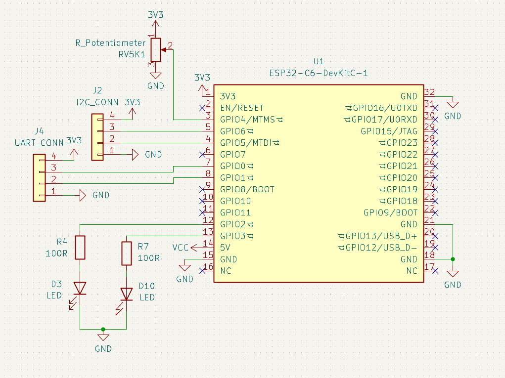
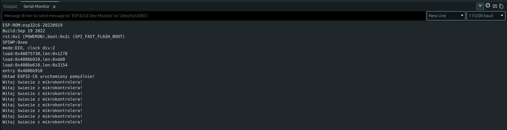
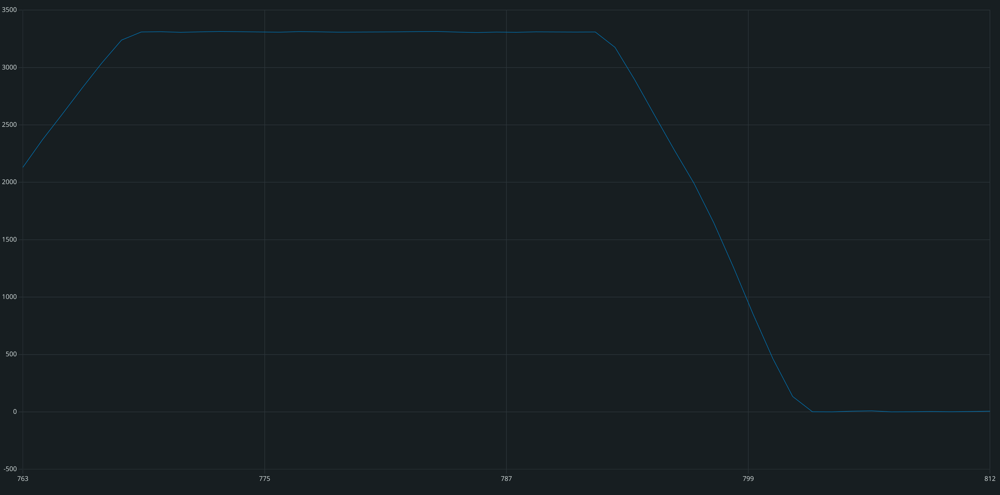

# Podstawy programowania mikrokontrolerów
---

## CZĘŚĆ 1: Sprzęt i przygotowanie do pracy

### 1. ESP32-C6 i dedykowana płytka
Podczas tych zajęć będziemy korzystać z układu **ESP32-C6**. Jest to mikrokontroler oparty na otwartej architekturze **RISC-V**, który posiada wbudowaną obsługę łączności bezprzewodowej: Wi-Fi 6, Bluetooth LE oraz protokołów Smart Home (Zigbee / Thread). Układ posiada również szereg innych zaawansowanych peryferiów. Wykorzystamy między innymi wbudowany **przetwornik ADC**, który pozwala mierzyć napięcie (np. z potencjometru). Ponadto układ obsługuje popularne standardy komunikacji, takie jak **SPI, I2C oraz UART**, co pozwala mu "rozmawiać" z niemal każdym zewnętrznym sensorem czy modułem dostępnym na rynku.

> [!IMPORTANT] Ważne!
> **Jak czytać schemat i odnaleźć numery pinów?**
> Początkujący często próbują wpisywać w kodzie fizyczne numery nóżek samego układu scalonego (czarnego "chipu"). **To błąd!** W programie zawsze posługujemy się numerami portów **GPIO** (ang. *General-Purpose Input/Output*). 
> * **Wskazówka:** Numery pinów GPIO są również nadrukowane (zazwyczaj jako białe napisy) na pinoutach wzdłuż krawędzi płytki, obok otworów do lutowania.

> [!NOTE] Dla ciekawskich
> **Strapping Pins** -
> niektóre piny (np. GPIO8, GPIO9) mają specjalne znaczenie podczas startu układu (tzw. *strapping pins*). Jeśli podłączymy do nich coś, co wymusi na nich konkretny stan w momencie włączania zasilania, mikrokontroler może nie wystartować poprawnie lub wejść w tryb programowania.

Poniżej znajduje się schemat naszej zestawowej płytki edukacyjnej:



Analizując schemat, możemy odczytać, do których pinów GPIO podłączone są poszczególne elementy. To właśnie te numery wpiszemy w naszym kodzie:

| Element na płytce | Oznaczenie na schemacie | Numer pinu w kodzie (GPIO) | Opis |
| :--- | :--- | :--- | :--- |
| **Dioda LED 1** | `D3 LED` | **2** | Wyjście cyfrowe / PWM (stan wysoki włącza diodę) |
| **Dioda LED 2** | `D10 LED` | **3** | Wyjście cyfrowe / PWM |
| **Potencjometr**| `RV5K1` | **4** | Wejście analogowe (pomiar napięcia ADC) |
| **Złącze I2C** | `J2 I2C_CONN` | **5** (SDA), **6** (SCL) | Cyfrowa magistrala do czujników (np. MPU6050) |
| **Złącze UART** | `J4 UART_CONN` | **0** (TX), **1** (RX) | Linie komunikacji szeregowej z drugim ESP |

> [!NOTE] Inne
> Pozostałe piny na schemacie, które są oznaczone symbolem **X**, nie będą wykorzystywane w tym kursie.

---

## CZĘŚĆ 2: Podstawy struktury programu w Arduino IDE

Każdy program pisany w środowisku Arduino (nazywany *szkicem* / *sketchem*) składa się z dwóch głównych bloków (funkcji):

```cpp
void setup() {
  // Ten kod wykonuje się tylko RAZ, zaraz po włączeniu zasilania 
  // lub wciśnięciu przycisku RESET.
  // Tutaj konfigurujemy piny, uruchamiamy porty komunikacyjne itp.
}

void loop() {
  // Ten kod wykonuje się w NIESKOŃCZONĄ PĘTLĘ (z góry na dół i od nowa).
  // Tutaj umieszczamy główną logikę programu, odczyty z czujników,
  // sterowanie diodami itp.
}
```

---

## CZĘŚĆ 3: Ćwiczenia Praktyczne

### Ćwiczenie 1: „Witaj świecie!” – Wysłanie wiadomości do komputera
Mikrokontroler nie posiada własnego monitora. Aby dowiedzieć się, co dzieje się wewnątrz układu, używamy **Portu Szeregowego (Serial Port)** do przesyłania tekstowych wiadomości przez kabel USB do komputera. W pierwszym ćwiczeniu wgrywamy kompletny kod, aby upewnić się, że połączenie z płytką działa poprawnie.

#### Kod do wgrania:
```cpp
void setup() {
  // Uruchomienie komunikacji z prędkością 115200 bitów na sekundę
  Serial.begin(115200);
  
  // Wysłanie pojedynczej wiadomości po uruchomieniu
  Serial.println("Układ ESP32-C6 uruchomiony pomyślnie!");
}

void loop() {
  // Wysyłanie wiadomości co sekundę
  Serial.println("Witaj świecie z mikrokontrolera!");
  
  // Opóźnienie programu o 1000 milisekund (1 sekunda)
  delay(1000);
}
```

> [!TIP] Wskazówka
> **Jak zobaczyć wynik?**
> 1. Wgraj program na płytkę.
> 2. W Arduino IDE kliknij ikonę lupy w prawym górnym rogu (lub użyj skrótu `Ctrl + Shift + M`), aby otworzyć **Monitor Portu Szeregowego (Serial Monitor)**.
> 3. Upewnij się, że w dolnym rogu okna wybrano prędkość **115200 baud**.

> [!NOTE] Dla ciekawskich
> **Co to jest baud?**
> Prędkość **baud** (bod) określa, ile symboli (bitów danych) jest przesyłanych w ciągu jednej sekundy. Ustawienie 115200 baud oznacza szybką komunikację. Ważne jest, aby prędkość ustawiona w kodzie (`Serial.begin`) była identyczna z tą wybraną w Monitorze Szeregowym – inaczej zamiast tekstu zobaczysz "krzaki" lub dziwne znaki.



#### Zadanie do samodzielnego wykonania:
Dodaj w pętli `loop()` drugą instrukcję `Serial.println(...)` z dowolnym własnym tekstem (np. Twoim imieniem), aby mikrokontroler co sekundę wysyłał na ekran **dwulinijkowy** komunikat.

---

### Ćwiczenie 2: Sterowanie wyjściem cyfrowym – Miganie diodą
W tym ćwiczeniu nauczymy się sterować elementem fizycznym. Wyjście cyfrowe mikrokontrolera może przyjąć dwa stany:

* **HIGH (stan wysoki):** na pinie pojawia się napięcie 3.3V – dioda świeci.
* **LOW (stan niski):** napięcie spada do 0V (połączenie z masą) – dioda gaśnie.

Z naszego schematu wiemy, że dioda `D3` podłączona jest do pinu **GPIO2**. Funkcja `digitalWrite(pin, stan)` pozwala ustawić żądany stan na wybranym pinie.

#### Uzupełnij kod i wgraj na płytkę:
```cpp
// Definiujemy stałą z numerem pinu, aby kod był czytelniejszy
const int PIN_LED1 = 2;

void setup() {
  // Konfigurujemy pin 2 jako WYJŚCIE (OUTPUT)
  pinMode(PIN_LED1, OUTPUT);
}

void loop() {
  // UZUPEŁNIJ: Włącz diodę podając stan wysoki (HIGH) na PIN_LED1
  delay(500);                   // Odczekanie pół sekundy (500 ms)
  
  // UZUPEŁNIJ: Wyłącz diodę podając stan niski (LOW) na PIN_LED1
  delay(500);                   // Odczekanie pół sekundy
}
```

#### Zadanie do samodzielnego wykonania:
Na płytce znajduje się druga dioda (`D10`) podłączona do pinu **GPIO3**. Zmodyfikuj program tak, aby uzyskać efekt **naprzemiennego migania obu diod** (gdy jedna się zapala, druga natychmiast gaśnie).

---

### Ćwiczenie 3: Płynna regulacja jasności – Sygnał PWM
Wyjście cyfrowe daje nam tylko opcje włącz/wyłącz. Co jeśli chcemy płynnie regulować jasność diody?
Wykorzystujemy technikę **PWM (Pulse Width Modulation)**. Polega ona na bardzo szybkim włączaniu i wyłączaniu pinu. Zmieniając stosunek czasu włączenia do wyłączenia, ludzkie oko uśrednia ilość światła i widzi płynną zmianę jasności.

W Arduino służy do tego funkcja `analogWrite(pin, wartość)`, gdzie wartość to liczba od **0** (całkowicie zgaszona) do **255** (maksymalna jasność).

#### Uzupełnij kod i wgraj na płytkę:
```cpp
const int PIN_LED1 = 2;

void setup() {
  pinMode(PIN_LED1, OUTPUT);
}

void loop() {
  // Pętla stopniowo zwiększająca zmienną 'jasnosc' od 0 do 255
  for (int jasnosc = 0; jasnosc <= 255; jasnosc++) {
    // UZUPEŁNIJ: Użyj odpowiedniej funkcji, aby ustawić jasność PIN_LED1
    delay(10); // Krótkie opóźnienie dla płynnego animowania
  }
  
  // Pętla stopniowo zmniejszająca zmienną 'jasnosc' od 255 do 0
  for (int jasnosc = 255; jasnosc >= 0; jasnosc--) {
    // UZUPEŁNIJ: Ponownie użyj odpowiedniej funkcji dla opadającej wartości
    delay(10);
  }
}
```

#### Zadanie do samodzielnego wykonania (Diody w przeciwfazie):
Podłącz drugą diodę (`const int PIN_LED2 = 3;` w nagłówku oraz `pinMode` w `setup`).
Uzyskaj efekt, w którym gdy jedna dioda się rozjaśnia, druga w tym samym czasie płynnie gaśnie.

<details>
<summary>Podpowiedź</summary>
Wewnątrz istniejących pętli <code>for</code> dopisz sterowanie drugą diodą tak, aby jej jasność wynosiła zawsze <b><code>255 - jasnosc</code></b>.
</details>

---

### Ćwiczenie 4: Wejście analogowe – Odczyt z potencjometru
Świat fizyczny jest analogowy (temperatura, oświetlenie czy położenie gałki zmieniają się płynnie). Aby mikrokontroler mógł odczytać płynne napięcie z potencjometru, wykorzystuje wbudowany moduł **ADC (Przetwornik Analogowo-Cyfrowy)**.

Potencjometr na naszej płytce działa jak dzielnik napięcia i w zależności od obrotu podaje na pin **GPIO4** napięcie od 0V do 3.3V. Przetwornik ADC w ESP32 zamienia to napięcie na liczbę z zakresu **od 0 do 4095** (rozdzielczość 12-bitowa). Służy do tego funkcja `analogRead(pin)`.

> [!NOTE] Notatka
> **Jak działa funkcja map()?**
> Zanim uzupełnisz kod, warto poznać funkcję `map()`. Pozwala ona proporcjonalnie przeskalować wartość z jednego zakresu na inny (np. z 0-4095 na 0-255). Przyjmuje 5 parametrów:
> `map(wartość_wejściowa, min_wejście, max_wejście, min_wyjście, max_wyjście)`
> W naszym przykładzie: bierze odczytaną z potencjometru liczbę od 0 do 4095 i zamienia ją na odpowiednią wartość PWM od 0 do 255.

#### Uzupełnij kod i wgraj na płytkę:
```cpp
const int PIN_POTENCJOMETR = 4;
const int PIN_LED = 2;

void setup() {
  Serial.begin(115200);
  pinMode(PIN_LED, OUTPUT);
  // Piny analogowe nie wymagają ustawiania pinMode jako INPUT
}

void loop() {
  // UZUPEŁNIJ: Odczytaj wartość z potencjometru za pomocą odpowiedniej funkcji i zapisz ją w zmiennej "odczyt"
  int odczyt = ;
  
  // Wypisanie wyniku do Serial Monitora
  Serial.println(odczyt);
  
  // UZUPEŁNIJ: Przeskaluj zakres odczytu ADC (0-4095) na zakres jasności PWM (0-255)
  int jasnosc = map(/* TUTAJ WPISZ ARGUMENTY FUNKCJI */);
  
  analogWrite(PIN_LED, jasnosc);
  
  delay(50);
}
```

> [!TIP] Wskazówka
> **Narzędzie Serial Plotter**
> Zamiast czytać suche liczby, otwórz w Arduino IDE menu **Narzędzia -> Kreślarka portu szeregowego (Serial Plotter)**. Pokręć potencjometrem, a zobaczysz piękny, rysowany na żywo wykres zmian napięcia!



#### Zadanie do samodzielnego wykonania (Termostat / Próg alarmowy):
Często odczyt z czujnika nie służy do płynnej regulacji, lecz do załączania ostrzeżenia po przekroczeniu pewnego progu. Zmodyfikuj program tak, aby całkowicie usunąć `analogWrite` oraz `map()`, a zamiast tego użyć instrukcji warunkowej `if ... else`:

* Jeśli odczytana wartość z potencjometru jest **większa niż 3000**, włącz diodę LED (stan `HIGH`).
* W przeciwnym wypadku (odczyt ≤ 3000), wyłącz diodę (stan `LOW`).

---

### Ćwiczenie 5: Magistrala I2C i zaawansowany czujnik MPU6050
Gdy chcemy podłączyć zaawansowane cyfrowe czujniki (np. wyświetlacze OLED, czujniki ciśnienia czy sensory ruchu), używamy magistrali **I2C**. Wykorzystuje ona tylko dwa przewody:

* **SDA (Serial Data):** linia przesyłania danych.
* **SCL (Serial Clock):** linia zegarowa synchronizująca przesył.

Na jednym zestawie przewodów można podłączyć wiele urządzeń, ponieważ każde z nich ma swój unikalny adres cyfrowy. Nasze złącze `J2` podłączone jest do pinów **5 (SDA)** oraz **6 (SCL)**.

Podłączymy do niego moduł **MPU6050** (zawierający 3-osiowy akcelerometr oraz żyroskop, używany między innymi w dronach do stabilizacji lotu).

#### Instalacja biblioteki:
Zanim napiszemy kod, musimy zainstalować bibliotekę, która ułatwi nam komunikację z czujnikiem.

1. W Arduino IDE wybierz: **Szkic -> Dołącz bibliotekę -> Zarządzaj bibliotekami...**
2. Wyszukaj: **MPU6050_light** (autor: rfetick).
3. Kliknij **Zainstaluj**.

{ width="60%" }

#### Uzupełnij kod odczytu w pętli loop():
```cpp
#include <Wire.h>
#include <MPU6050_light.h>

// Tworzymy obiekt reprezentujący nasz czujnik
MPU6050 mpu(Wire);

// Definicja naszych pinów I2C ze schematu
const int I2C_SDA = 5;
const int I2C_SCL = 6;

void setup() {
  Serial.begin(115200);
  
  // Konfiguracja magistrali I2C na naszych konkretnych pinach
  Wire.begin(I2C_SDA, I2C_SCL);
  
  Serial.println("Inicjalizacja czujnika MPU6050...");
  byte status = mpu.begin();
  
  if (status != 0) {
    Serial.println("Błąd połączenia z MPU6050! Sprawdź połączenia.");
    while (1); // Zatrzymanie programu w przypadku błędu
  }
  
  Serial.println("Czujnik wykryty! Nie ruszaj płytką - trwa kalibracja...");
  delay(1000);
  mpu.calcOffsets(); // Kalibracja początkowego położenia
  Serial.println("Kalibracja zakończona!");
}

void loop() {
  // Pobranie najnowszych pomiarów z czujnika
  mpu.update();
  
  // Odczyt kątów nachylenia w osiach X i Y
  Serial.print("Kat X: ");
  Serial.print(mpu.getAngleX());
  Serial.print("\tKat Y: ");
  Serial.println(mpu.getAngleY());
  
  delay(100);
}
```

#### Zadanie do samodzielnego wykonania (Czarna skrzynka / Wykrywacz wstrząsu):
Zmieńmy koncepcję: zamiast badać powolny przechył, stwórzmy układ reagujący na gwałtowne przeciążenia (np. wykrywanie kolizji robota lub uderzenia).
Czujnik MPU6050 za pomocą akcelerometru stale mierzy przyśpieszenie w trzech osiach. Biblioteka udostępnia do tego gotowe metody `mpu.getAccX()`, `mpu.getAccY()` oraz `mpu.getAccZ()` (wartość 1.0 oznacza standardowe przyśpieszenie ziemskie **1g**).

* Dopisz w pętli `loop()` warunek sprawdzający, czy przyśpieszenie w osi X lub Y przekroczyło próg **`2.0`** (silny wstrząs/uderzenie).
* Jeśli wstrząs zostanie wykryty, natychmiast zapal czerwoną diodę na stałe (stan `HIGH`) jako zapisaną flagę alarmową informującą o zderzeniu.

---

### Ćwiczenie 6: Rozmowa dwóch mikrokontrolerów – Interfejs UART
Często projekty wymagają połączenia ze sobą dwóch oddzielnych układów (np. główny sterownik i moduł GPS lub komunikacja przewodowa dwóch płytek ESP). Służy do tego interfejs **UART (Universal Asynchronous Receiver-Transmitter)**.

Wymaga on połączenia trzech linii ze złącza `J4`:

1. **Masa (GND):** Płytki muszą mieć wspólną masę.
2. **TX (Nadajnik z ESP A) -> RX (Odbiornik w ESP B)**
3. **RX (Odbiornik w ESP A) -> TX (Nadajnik w ESP B)**

> [!WARNING] Pamiętaj o skrzyżowaniu linii!
> Piny nadawcze (TX) zawsze łączymy z pinami odbiorczymi (RX) drugiego urządzenia. Połączenie TX-TX lub RX-RX nie zadziała.

Ze schematu odczytujemy piny na złączu `J4`: **GPIO0** (linia 3 złącza) oraz **GPIO1** (linia 2 złącza). Skonfigurujemy je jako interfejs sprzętowy `Serial1`.

#### Kod dla Płytki A (Nadajnik):
Ta płytka czeka na wpisanie cyfry na klawiaturze (w Monitorze Szeregowym komputera), a następnie przesyła ją kablem do drugiej płytki.

```cpp
const int UART_TX = 0;
const int UART_RX = 1;

void setup() {
  // Główny port do podglądu na komputerze
  Serial.begin(115200);
  
  // Uruchomienie drugiego portu UART do komunikacji z ESP B
  Serial1.begin(9600, SERIAL_8N1, UART_RX, UART_TX);
  
  Serial.println("Nadajnik gotowy. Wpisz cyfre (0-9) w Monitorze Szeregowym!");
}

void loop() {
  // Sprawdzamy, czy UŻYTKOWNIK wpisał coś na klawiaturze komputera
  if (Serial.available() > 0) {
    // Odczytujemy znak z klawiatury
    char znak = Serial.read();
    
    // Przesyłamy ten sam znak dalej, do drugiej płytki przez Serial1
    Serial1.print(znak);
    
    Serial.print("Wyslano do drugiej plytki: ");
    Serial.println(znak);
  }
}
```

#### Kod dla Płytki B (Odbiornik):
Ta płytka odbiera cyfrę i w zależności od jej wartości steruje jasnością diody.

```cpp
const int PIN_LED = 2;
const int UART_TX = 0;
const int UART_RX = 1;

void setup() {
  Serial.begin(115200);
  Serial1.begin(9600, SERIAL_8N1, UART_RX, UART_TX);
  pinMode(PIN_LED, OUTPUT);
  
  Serial.println("Odbiornik gotowy. Czekam na dane...");
}

void loop() {
  // Sprawdź, czy na porcie Serial1 nadeszły dane od Płytki A
  if (Serial1.available() > 0) {
    // Odczytaj odebrany znak za pomocą Serial1.read()
    char odebranyZnak = Serial1.read();
    
    Serial.print("Odebrano: ");
    Serial.println(odebranyZnak);
    
    // ZABEZPIECZENIE: Sprawdzamy, czy odebrany znak to rzeczywiście cyfra od '0' do '9'.
    // Zapobiega to błędom, gdy ktoś wyśle np. literę 'd' lub znak nowej linii.
    if (odebranyZnak >= '0' && odebranyZnak <= '9') {
      // Konwertujemy znak na cyfrę i ustawiamy jasność diody
      // (Odejmujemy kod ASCII znaku '0')
      int cyfra = odebranyZnak - '0'; 
      
      // Skalowamy cyfrę (0-9) na jasność PWM (0-255)
      int jasnosc = map(cyfra, 0, 9, 0, 255);
      
      analogWrite(PIN_LED, jasnosc);
    }
  }
}
```

> [!NOTE] Dla ciekawskich
> **Czym jest kod ASCII?**
> Komputery i mikrokontrolery nie rozumieją liter ani znaków – przetwarzają wyłącznie liczby. Dlatego każdy znak ma przypisaną stałą wartość liczbową w tzw. **tabeli ASCII** (np. znak `'0'` to w pamięci liczba 48, znak `'1'` to 49, a literka `'A'` to 65).
> Zapis `odebranyZnak - '0'` to popularny programistyczny trik: odejmując kod ASCII zera (48) od kodu ASCII odebranego znaku (np. `'5'`, czyli 53), otrzymujemy czystą wartość liczbową: **53 - 48 = 5**.

#### Zadanie do samodzielnego wykonania (Sterowanie komendami literowymi):
Zamiast przesyłać cyfry regulujące jasność, zmodyfikuj program Odbiornika (Płytki B) tak, aby reagował na konkretne **litery** działające jako polecenia:

* Jeśli odebrany znak to **`'W'`** (Włącz), zapal diodę na stałe (`digitalWrite(PIN_LED, HIGH)`).
* Jeśli odebrany znak to **`'G'`** (Gaś), wyłącz diodę (`digitalWrite(PIN_LED, LOW)`).

<details>
<summary>Podpowiedź</summary>
Do porównania odebranych znaków użyj instrukcji warunkowej, na przykład: <code>if (odebranyZnak == 'W') { ... } else if (odebranyZnak == 'G') { ... }</code>.
</details>
